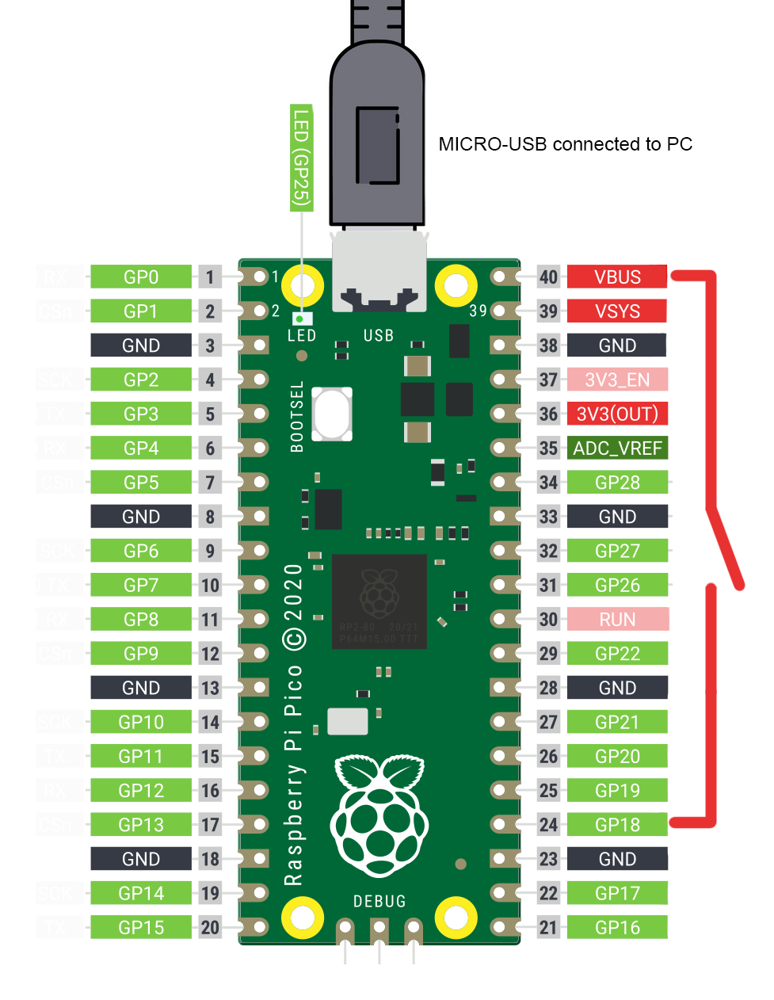
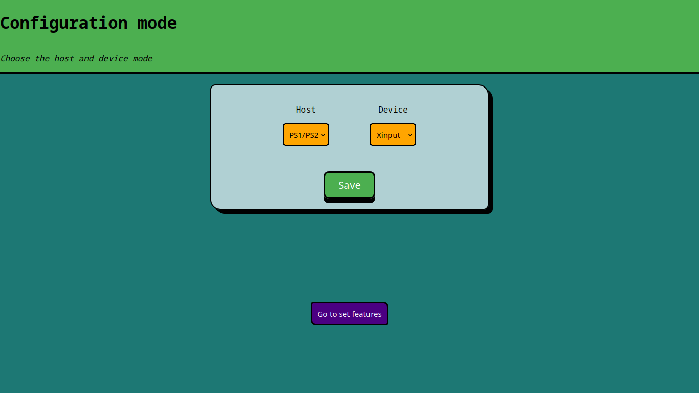

# Pico Gamepad Converter
Enable old gamepads that don't support USB connections to be compatibles with certain platforms, such as Switch, PS1/PS2, Gamecube, Wii.

Credit goes out to the original creator: https://github.com/Loc15/PicoGamepadConverter

---

This is my simplified guide of that project: 

### Installation

1. [Download](https://github.com/Loc15/PicoGamepadConverter/releases) the build program.
   
2. Hold down the **BOOTSEL** button on the pico, connect the USB-cable to the PC, the pico should now show up as a USB-drive. Copy the downloaded **.uf2** file to the pico. The pico should now restart and be programmed.  

4. Enter config mode. You can just hold a wire from **VBUS (+5V)** to **pin GP18** during boot of the pico. LED on the pico will start to blink, now you're in config mode. 

5. Go to http://192.168.3.1 in a web browser to begin configuration. Host → The controller you plug into the Pico. Device → The system you plug the Pico into.

6. Connect your gamepad, when it's connected successfully the LED on the board will turn on.

7. Enjoy!

